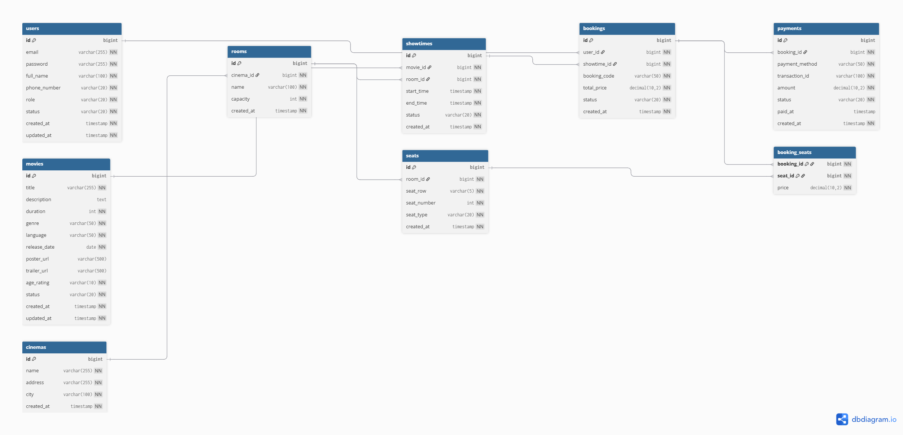

# Database Design

---

## Entities

### Users
Stores user account information.

| Field | Type | Constraints | Description |
|---|---|---|---|
| id | BIGINT | PK, AUTO_INCREMENT | User id |
| email | VARCHAR(255) | UNIQUE, NOT NULL | User email |
| password | VARCHAR(255) | NOT NULL | Hashed password |
| full_name | VARCHAR(100) | NOT NULL | Full name |
| phone_number | VARCHAR(20) | NOT NULL | Phone number |
| role | VARCHAR(20) | NOT NULL | USER / ADMIN |
| status | VARCHAR(20) | NOT NULL | ACTIVE / INACTIVE |
| created_at | TIMESTAMP | NOT NULL | Created time |
| updated_at | TIMESTAMP | NOT NULL | Updated time |

---

### Movies
Stores movie information.

| Field | Type | Constraints | Description |
|---|---|---|---|
| id | BIGINT | PK, AUTO_INCREMENT | Movie id |
| title | VARCHAR(255) | NOT NULL | Movie title |
| description | TEXT | NULL | Movie description |
| duration | INT | NOT NULL | Duration in minutes |
| genre | VARCHAR(50) | NOT NULL | Movie genre |
| language | VARCHAR(50) | NOT NULL | Movie language |
| release_date | DATE | NOT NULL | Release date |
| poster_url | VARCHAR(500) | NULL | Poster URL |
| trailer_url | VARCHAR(500) | NULL | Trailer URL |
| age_rating | VARCHAR(10) | NOT NULL | Age restriction |
| status | VARCHAR(20) | NOT NULL | ACTIVE / INACTIVE |
| created_at | TIMESTAMP | NOT NULL | Created time |
| updated_at | TIMESTAMP | NOT NULL | Updated time |

---

### Cinemas
Stores cinema branch information.

| Field | Type | Constraints | Description |
|---|---|---|---|
| id | BIGINT | PK, AUTO_INCREMENT | Cinema id |
| name | VARCHAR(255) | NOT NULL | Cinema name |
| address | VARCHAR(255) | NOT NULL | Cinema address |
| city | VARCHAR(100) | NOT NULL | City |
| created_at | TIMESTAMP | NOT NULL | Created time |

---

### Rooms
Stores screening rooms.

| Field | Type | Constraints | Description |
|---|---|---|---|
| id | BIGINT | PK, AUTO_INCREMENT | Room id |
| cinema_id | BIGINT | FK, NOT NULL | Cinema id |
| name | VARCHAR(100) | NOT NULL | Room name |
| capacity | INT | NOT NULL | Total seats |
| created_at | TIMESTAMP | NOT NULL | Created time |

---

### Seats
Stores room seat information.

| Field | Type | Constraints | Description |
|---|---|---|---|
| id | BIGINT | PK, AUTO_INCREMENT | Seat id |
| room_id | BIGINT | FK, NOT NULL | Room id |
| seat_row | VARCHAR(5) | NOT NULL | Seat row |
| seat_number | INT | NOT NULL | Seat number |
| seat_type | VARCHAR(20) | NOT NULL | NORMAL / VIP / COUPLE |
| created_at | TIMESTAMP | NOT NULL | Created time |

---

### Showtimes
Stores movie schedules.

| Field | Type | Constraints | Description |
|---|---|---|---|
| id | BIGINT | PK, AUTO_INCREMENT | Showtime id |
| movie_id | BIGINT | FK, NOT NULL | Movie id |
| room_id | BIGINT | FK, NOT NULL | Room id |
| start_time | TIMESTAMP | NOT NULL | Start time |
| end_time | TIMESTAMP | NOT NULL | End time |
| status | VARCHAR(20) | NOT NULL | ACTIVE / CANCELLED |
| created_at | TIMESTAMP | NOT NULL | Created time |

---

### Bookings
Stores booking transactions.

| Field | Type | Constraints | Description |
|---|---|---|---|
| id | BIGINT | PK, AUTO_INCREMENT | Booking id |
| user_id | BIGINT | FK, NOT NULL | User id |
| showtime_id | BIGINT | FK, NOT NULL | Showtime id |
| booking_code | VARCHAR(50) | UNIQUE, NOT NULL | Booking code |
| total_price | DECIMAL(10,2) | NOT NULL | Total amount |
| status | VARCHAR(20) | NOT NULL | PENDING / PAID / CANCELLED |
| created_at | TIMESTAMP | NOT NULL | Created time |

---

### Booking_Seats
Stores selected seats in a booking.

| Field | Type | Constraints | Description |
|---|---|---|---|
| booking_id | BIGINT | PK, FK, NOT NULL | Booking id |
| seat_id | BIGINT | PK, FK, NOT NULL | Seat id |
| price | DECIMAL(10,2) | NOT NULL | Seat price |

---

### Payments
Stores payment transactions.

| Field | Type | Constraints | Description |
|---|---|---|---|
| id | BIGINT | PK, AUTO_INCREMENT | Payment id |
| booking_id | BIGINT | FK, NOT NULL | Booking id |
| payment_method | VARCHAR(50) | NOT NULL | Payment provider |
| transaction_id | VARCHAR(100) | UNIQUE, NOT NULL | Transaction id |
| amount | DECIMAL(10,2) | NOT NULL | Payment amount |
| status | VARCHAR(20) | NOT NULL | PENDING / SUCCESS / FAILED |
| paid_at | TIMESTAMP | NULL | Payment time |
| created_at | TIMESTAMP | NOT NULL | Created time |

---

## Primary Keys

- users.id
- movies.id
- cinemas.id
- rooms.id
- seats.id
- showtimes.id
- bookings.id
- payments.id

### Composite Primary Key
- booking_seats (booking_id, seat_id)

---

## Foreign Keys

| Table | Foreign Key | References |
|---|---|---|
| rooms | cinema_id | cinemas.id |
| seats | room_id | rooms.id |
| showtimes | movie_id | movies.id |
| showtimes | room_id | rooms.id |
| bookings | user_id | users.id |
| bookings | showtime_id | showtimes.id |
| booking_seats | booking_id | bookings.id |
| booking_seats | seat_id | seats.id |
| payments | booking_id | bookings.id |

---

## Relationships

- One Cinema has many Rooms
- One Room has many Seats
- One Movie has many Showtimes
- One Room has many Showtimes
- One User has many Bookings
- One Showtime has many Bookings
- One Booking has many Booking Seats
- One Seat can belong to many Booking Seats
- One Booking has one Payment